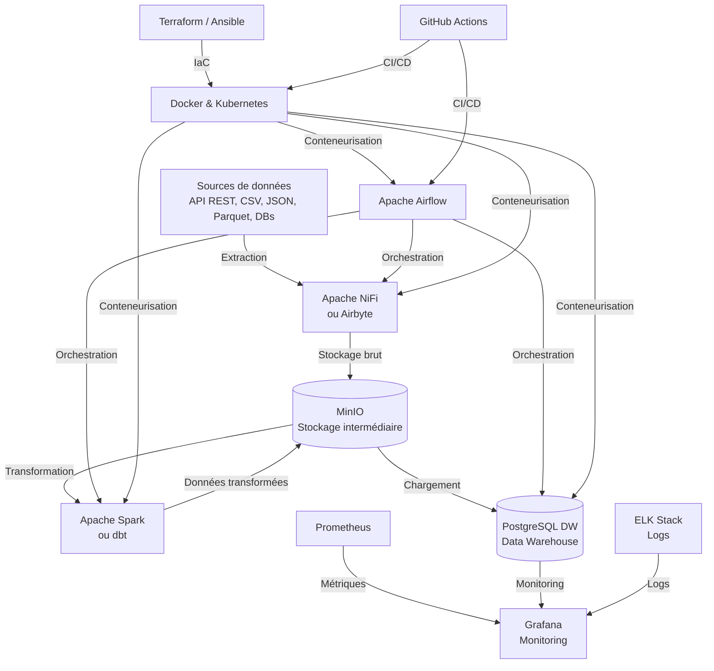

# Architecture du Projet ETL-Cloud

## Vue d'ensemble
Le projet ETL-Cloud est une solution complète pour l'extraction, transformation et chargement de données dans un environnement cloud. L'architecture est conçue pour être scalable, fiable et facile à maintenir.

## Composants principaux

### 1. Extraction (E)
- **Apache NiFi**: Orchestrateur de flux de données pour l'extraction depuis diverses sources
- **Sources supportées**:
  - API REST (JSON)
  - Bases de données relationnelles (PostgreSQL, MySQL)
  - Fichiers (CSV, JSON, Parquet)
  - Flux Kafka

### 2. Stockage intermédiaire
- **MinIO**: Stockage objet compatible S3 pour les données brutes et transformées
- Organisation des buckets:
  - `raw-data`: Données brutes extraites
  - `cleaned-data`: Données nettoyées
  - `enriched-data`: Données enrichies

### 3. Transformation (T)
- **Apache Spark**: Traitement distribué pour les transformations complexes
- **dbt**: Transformation SQL pour les modèles de données dans le data warehouse

### 4. Chargement (L)
- **PostgreSQL**: Data warehouse principal avec partitionnement et optimisations
- Schémas:
  - `staging`: Données temporaires
  - `analytics`: Données transformées pour l'analyse
  - `metrics`: Indicateurs de performance

### 5. Orchestration
- **Apache Airflow**: Orchestration des workflows ETL avec gestion des dépendances
- Fonctionnalités:
  - Reprocessing automatique en cas d'échec
  - Alerting par email/Slack
  - Historique des exécutions

## Diagramme d'architecture

## Illustration
